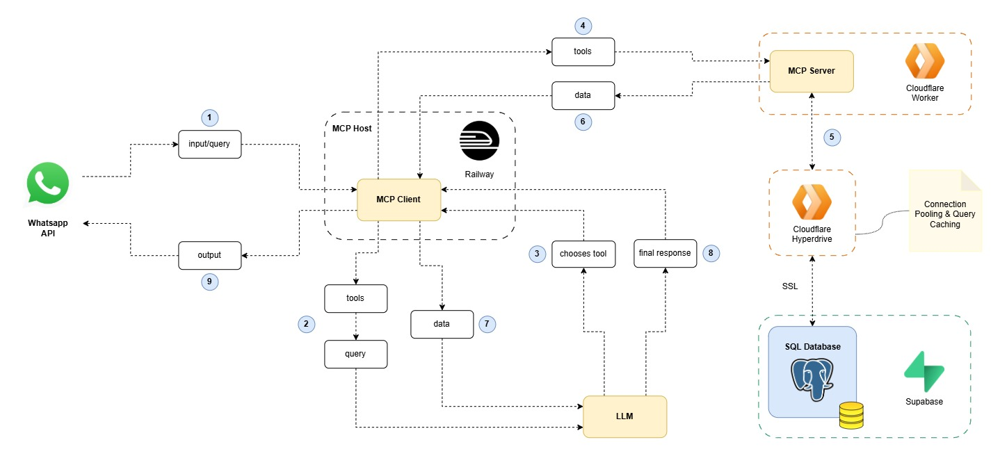
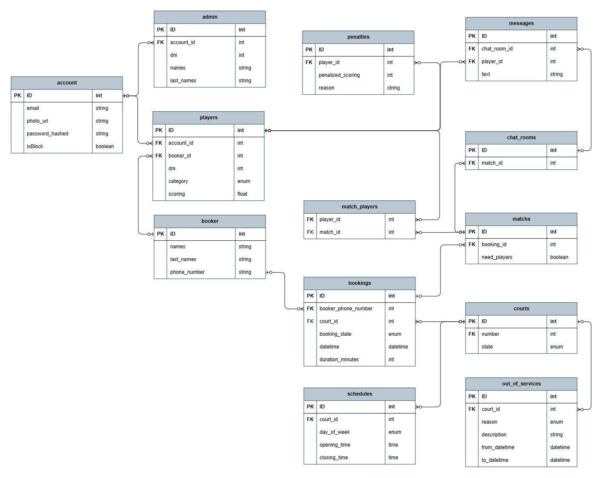

# quento-ai-agent

Quento es un asistente conversacional para la gestión de reservas de una cancha de pádel a través de WhatsApp. Un LLM interpreta los mensajes del usuario, decide qué acción tomar y la ejecuta mediante herramientas (tools) expuestas por un **servidor MCP** que a su vez opera sobre una base de datos PostgreSQL.

## Arquitectura



El sistema se divide en dos componentes principales:

- **MCP Client** (`mcp-client/`): corre en Railway. Recibe los mensajes entrantes desde la WhatsApp API, mantiene la conversación con el LLM y, cuando el LLM decide usar una herramienta, la invoca contra el MCP Server. También le pasa al LLM la lista de tools disponibles y los datos que las tools devuelven.
- **MCP Server** (`mcp-server/`): corre como un **Cloudflare Worker**. Expone las herramientas de negocio (reservas, canchas, partidos, etc.) vía el protocolo MCP (Streamable HTTP) y se conecta a la base de datos PostgreSQL a través de **Cloudflare Hyperdrive** (pooling de conexiones y cacheo de queries). La base de datos en producción es un PostgreSQL gestionado en **Supabase**.

Flujo de un mensaje (según el diagrama):

1. El usuario escribe por WhatsApp → llega como `input/query` al MCP Client.
2. El MCP Client pide al MCP Server la lista de `tools` disponibles.
3. El LLM, con el mensaje del usuario y las tools disponibles, decide qué tool usar (`chooses tool`).
4-5. El MCP Client invoca la tool elegida contra el MCP Server (Cloudflare Worker), que resuelve la query contra Postgres vía Hyperdrive.
6-7. El MCP Server devuelve los datos, que el MCP Client le pasa al LLM.
8. El LLM arma la `final response` en base a esos datos.
9. La respuesta se envía de vuelta al usuario por WhatsApp.

### Modelo de datos



Entidades principales:

- **account / admin / player / booker**: cuentas de usuario y sus roles (jugador, quien reserva, administrador).
- **courts**, **schedules**, **out_of_services**: canchas, horarios de apertura/cierre por día y períodos fuera de servicio.
- **bookings**: reservas de cancha asociadas a un `booker` y un horario.
- **matchs / match_players**: partidos abiertos a partir de una reserva y los jugadores anotados.
- **penalties**: penalizaciones de puntaje a jugadores.
- **chat_rooms / messages**: chats asociados a un partido.

El esquema vive como código en `mcp-server/src/db/schemas/*.ts` (Drizzle ORM), que es la fuente de verdad sobre el DER.

### Estructura del repo

```
.
├── docker-compose.yaml       # Postgres local para desarrollo
├── docs/
│   ├── mcp-arquitecture/     # Diagrama de arquitectura (.drawio / .jpg)
│   └── der/                  # Diagrama entidad-relación (.drawio / .jpg)
├── mcp-client/                # Cliente MCP (WhatsApp + LLM), desplegado en Railway
└── mcp-server/                 # Servidor MCP (Cloudflare Worker) + acceso a datos
    ├── src/
    │   ├── index.ts           # Entry point del Worker (fetch handler, auth, MCP transport)
    │   ├── server.ts          # Definición del McpServer y registro de tools
    │   ├── tools/             # Tools MCP agrupadas por dominio (bookings, courts, matches, booker)
    │   ├── db/
    │   │   ├── schemas/       # Esquema Drizzle (fuente de verdad del DER)
    │   │   ├── queries/       # Queries por entidad
    │   │   └── migrations/    # Migraciones generadas por drizzle-kit
    │   └── lib/               # Enums e interfaces compartidas
    ├── dev-server.ts          # Servidor HTTP plano para probar el Worker en local sin Wrangler
    └── wrangler.jsonc         # Config de Cloudflare Worker + binding de Hyperdrive
```

## Probar en local

Se necesita: Node.js, [pnpm](https://pnpm.io/) y Docker (para levantar Postgres).

### 1. Base de datos

Desde la raíz del repo:

```bash
cp .env.example .env
# completar POSTGRES_USER / POSTGRES_PASSWORD / POSTGRES_DB si se quiere cambiar el default
docker compose up -d
```

Esto levanta un Postgres 16 en `localhost:5432`.

### 2. MCP Server

```bash
cd mcp-server
cp .env.example .env
```

Completar `mcp-server/.env`:

```
DATABASE_URL="postgres://<POSTGRES_USER>:<POSTGRES_PASSWORD>@localhost:5432/<POSTGRES_DB>"
MCP_API_KEY="cualquier-string-secreto-para-local"
PORT=8787
```

Instalar dependencias y aplicar el esquema a la base:

```bash
pnpm install
pnpm db:push   # sincroniza el esquema de Drizzle contra la base local (puede pedir confirmación interactiva)
```

Levantar el servidor sin depender de Wrangler (recomendado para desarrollo rápido, usa `.env` directamente):

```bash
pnpm dev:local
```

Esto expone el Worker en `http://localhost:8787` mediante un servidor HTTP de Node (`dev-server.ts`) que traduce requests/responses al formato Web estándar que espera el `fetch` handler del Worker.

Alternativa: correrlo con el runtime real de Cloudflare (`workerd`) usando Wrangler:

```bash
pnpm dev
```

En este caso las variables de entorno deben estar en `mcp-server/.dev.vars` (Wrangler no lee `.env`), y la conexión a Postgres usa el `localConnectionString` del binding `hyperdrive` en `wrangler.jsonc`.

### 3. Probar el servidor

Health check:

```bash
curl http://localhost:8787/health
```

El protocolo MCP usa Streamable HTTP: toda request POST necesita los headers `Content-Type: application/json`, `Accept: application/json, text/event-stream` y `x-api-key` con el valor de `MCP_API_KEY`.

Listar herramientas disponibles:

```bash
curl -s -X POST http://localhost:8787 \
  -H "Content-Type: application/json" \
  -H "Accept: application/json, text/event-stream" \
  -H "x-api-key: <MCP_API_KEY>" \
  -d '{"jsonrpc":"2.0","id":1,"method":"tools/list","params":{}}'
```

Invocar una tool (ejemplo, `list_courts`):

```bash
curl -s -X POST http://localhost:8787 \
  -H "Content-Type: application/json" \
  -H "Accept: application/json, text/event-stream" \
  -H "x-api-key: <MCP_API_KEY>" \
  -d '{"jsonrpc":"2.0","id":2,"method":"tools/call","params":{"name":"list_courts","arguments":{}}}'
```

## Probar / desplegar en la nube

El MCP Server se despliega como Cloudflare Worker:

```bash
cd mcp-server
pnpm deploy   # wrangler deploy
```

Requisitos previos en Cloudflare:

- Un binding de **Hyperdrive** (`DB` en `wrangler.jsonc`) apuntando a la base de datos de producción (Supabase Postgres). El `id` del binding se configura desde el dashboard de Cloudflare o `wrangler hyperdrive create`.
- El secreto `MCP_API_KEY` cargado con Wrangler (no se sube al repo):

```bash
wrangler secret put MCP_API_KEY
```

Una vez desplegado, el Worker queda accesible en la URL pública que asigna Cloudflare, y se prueba igual que en local (mismos headers y mismo formato de requests), apuntando a esa URL en vez de `localhost:8787`.

El **MCP Client** se despliega en Railway y es el que efectivamente consume el MCP Server en producción: recibe los webhooks de la WhatsApp API, mantiene la conversación con el LLM y llama al Worker desplegado usando la URL pública y el `MCP_API_KEY` de producción.
